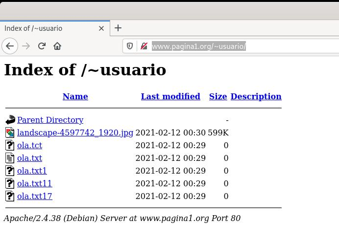
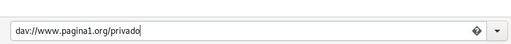
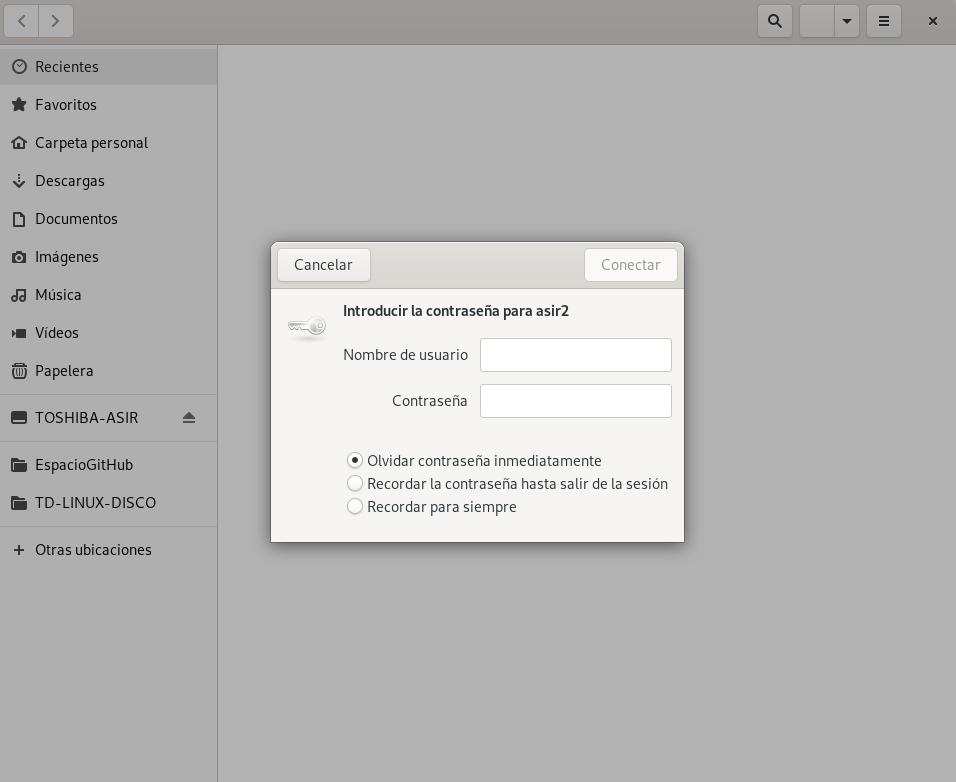

# Cargar Módulos (userdir y WebDav)

Apache tiene un sinfín de características adicionales que, si estuvieran siempre incluidas, harían de él un programa demasiado grande y pesado. En lugar de esto, Apache se compila de forma modular y se cargan en memoria sólo los módulos necesarios en cada caso.


Los módulos se guardan en la configuración de apache2 en dos directorios:
- `/etc/apache2/mods-available/`: Directorio que contiene los módulos disponibles en la instalación actual.
- `/etc/apache2/mods-enabled/`: Directorio que incluye mediante enlaces simbólicos al directorio anterior, los módulos que se van a cargar en memoria la próxima vez que se inicie Apache.

Para ver los módulos que tenemos, utilizaremos:

**Módulos que se cargan con apache2ctl (núcleo de apache):**
```bash
apache2ctl -l 
```

**Módulos disponibles. En la mayoría de los casos aparece un .load y .conf.**
```bash
ls --color -l /etc/apache2/mods-available   
```
En los ficheros load, solo aparece la llamada al módulo compilado (so).
En los ficheros .conf, está la configuración del módulo.
Por ejemplo: userdir.conf y userdir.load

**Vemos los módulos activos**

```bash
apache2ctl -M
```
## Módulo Userdir

*RREQUISITOS DIRECTIVA **INDEXES***

Userdir es un módulo de apache que hace posible que todos los usuarios con acceso a un servidor tengan una carpeta llamada public_html en la cual puedan alojar sus páginas y archivos.

```bash
#Módulo para la autenticación básica
ls -l --color /etc/apache2/mods-enabled/userdir.load
```

*Sí está desactivado...*

```bash
a2enmod userdir
systemctl restart apache2 
```

```bash
mkdir /home/usuario/public_html/
cd /home/usuario/public_html/
wget https://www.ecestaticos.com/imagestatic/clipping/9da/18c/9da18cdc3b033ca0375e7b9c1394c0d0/has-conseguido-que-llore-perdio-a-su-perro-pidio-ayuda-en-las-redes-y-esto-es-lo-que-paso.jpg?mtime=1579565836
mkdir cosas
touch masCosas.txt
touch masCosas2.txt
touch masCosas3.txt
chown -R usuario:usuario /home/usuario/public_html/
```

**Comprobar acceso web...**

```bash
#Cliente
firefox http://www.pagina1.org/~usuario/
```


## WebDav

**WebDAV** (“*Edición y versionado distribuidos sobre la web*“) es un protocolo para hacer que la www sea un medio legible y editable. Este protocolo proporciona funcionalidades para crear, cambiar y mover documentos en un servidor remoto (típicamente un servidor web).
 
Básicamente nos permite tener un directorio del servidor web, enlazado de forma que podamos subir, borrar y actualizar documentos , utilizando un cliente **WebDAV**. La mayoría de los SO’s ya traen incorporado esta funcionalidad en el explorador de archivos.

Configuración de un servidor **WebDAV**
Para crear un directorio en nuestro servidor Web que pueda ser accesible por medio de un cliente **WebDAV** **debemos activar los módulos ``dav y dav_fs``.**

```bash
vi /etc/apache2/sites-available/pagina1.conf
```

```apache
<VirtualHost *:80>
        ServerName www.pagina1.org
        ServerAdmin webmaster@localhost
        DocumentRoot /var/www/pagina1
        DavLockDB /tmp/DavLock
        <Directory /var/www/pagina1/privado>
                dav on
                Options Indexes FollowSymLinks MultiViews
                AllowOverride None
                AuthUserFile "/etc/apache2/claves/digest.txt"
                AuthName "asir2"
                AuthType Digest
                Require valid-user
        </Directory>
        ErrorLog ${APACHE_LOG_DIR}/error_pagina1.log
        CustomLog ${APACHE_LOG_DIR}/access_pagina1.log combined
</VirtualHost>

# vim: syntax=apache ts=4 somprueba sintaxis
```

```bash
a2enmod dav dav_fs 
ls -lR /var/www/pagina1/
chown -R www-data:www-data /var/www/pagina1/
systemctl restart apache2.service 
systemctl status apache2.service
```

```bash
nautilus dav://www.pagina1.org/privado
```



__________________________
*[Volver atrás...](/README.md)*

