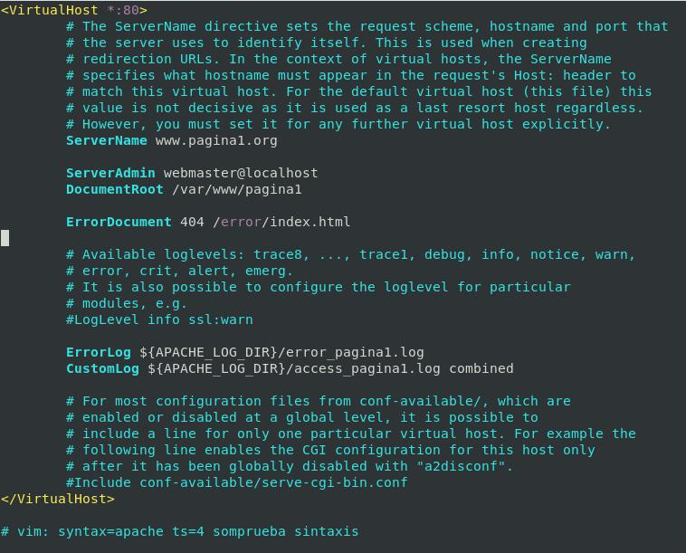
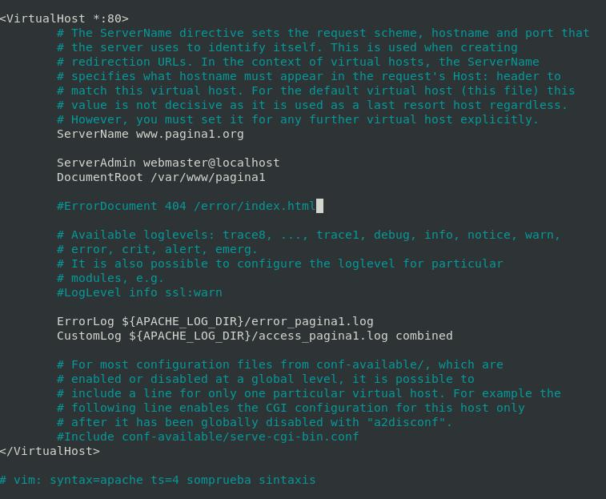
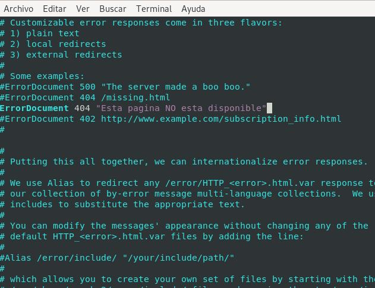
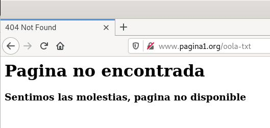
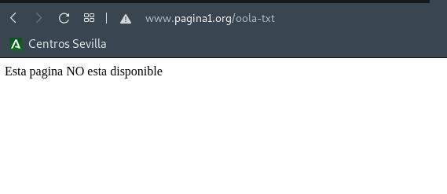

# Páginas de errores

Apache ofrece la posibilidad de que los administradores puedan configurar las respuestas que muestra el servidor Apache cuando se producen algunos errores o problemas. Se puede hacer que el servidor siga uno de los siguientes comportamientos:

1. Desplegar un texto diferente, en lugar de los mensajes que aparecen por defecto.
2. Redireccionar la petición a una URL local.
3. Redireccionar la petición a una URL externa.

La directiva ErrorDocument me permite configurar la página de error personalizada para cada tipo de error (código de estados). Por ejemplo:

```apache
ErrorDocument 403 "Sorry can't allow you access today" 
ErrorDocument 404 /error/404.html
ErrorDocument 500 http://www.pagina2.org/error.html
```

Páginas de error personalizadas podemos hacerlas en el fichero de configuración: `/etc/apache2/conf-available/localized-error-pages.conf`

## Configuración de Errores

*REQUISITOS*

*Registrar en servidor **DNS** el dominio, si no es posible, en el fichero ``/etc/hots``*

### Configuración para un Sitio Virtual en concreto.

```bash
vi /etc/apache2/sites-available/pagina1.conf
```



**Quitando comentarios y líneas en blanco**

```apache
<VirtualHost *:80>
	ServerName www.pagina1.org
	ServerAdmin webmaster@localhost
	DocumentRoot /var/www/pagina1
	ErrorDocument 404 /error/index.html
	ErrorLog ${APACHE_LOG_DIR}/error_pagina1.log
	CustomLog ${APACHE_LOG_DIR}/access_pagina1.log combined
</VirtualHost>

# vim: syntax=apache ts=4 somprueba sintaxis
```

**Sintaxis y Reiniciar Servicios...**

```bash
apache2ctl -t
systemctl restart apache2.service
systemctl status apache2.service
```

[**CLIC PARA COPIAR FICHERO**](./pagina1Para1Sitio.conf)

### Personalizar el error 404 para todos los virtualhost.

```bash
vi /etc/apache2/sites-available/pagina1.conf
```

*Quitamos la directivas ErrorDocument que vayamos a configurar (en mi caso el 404)*



**Quitando comentarios y líneas en blanco**

```apache
<VirtualHost *:80>
	ServerName www.pagina1.org
	ServerAdmin webmaster@localhost
	DocumentRoot /var/www/pagina1
    # ErrorDocument 404 /error/index.html
	ErrorLog ${APACHE_LOG_DIR}/error_pagina1.log
	CustomLog ${APACHE_LOG_DIR}/access_pagina1.log combined
</VirtualHost>

# vim: syntax=apache ts=4 somprueba sintaxis
```
**Añadir un error por defecto para todos los sitios virtuales**

```bash
vi /etc/apache2/conf-available/localized-error-pages.conf
```



```apache
ErrorDocument 404 "Esta web NO esta disponible"
```

**Sintaxis y Reiniciar Servicios...**

```bash
apache2ctl -t
systemctl restart apache2.service
systemctl status apache2.service
```

## Comprobaciones

```bash
firefix www.pagina1.org/dhasdlkhjasd
# SIN ENTORNO
curl www.pagina1.org/wuioehjlskad
```




__________________________
*[Volver atrás...](/README.md)*

