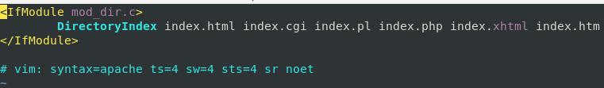
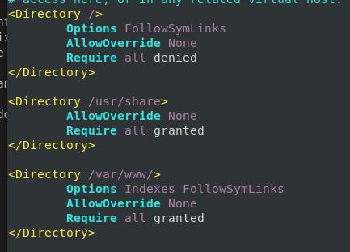
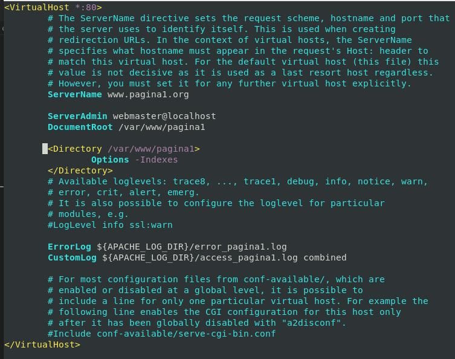
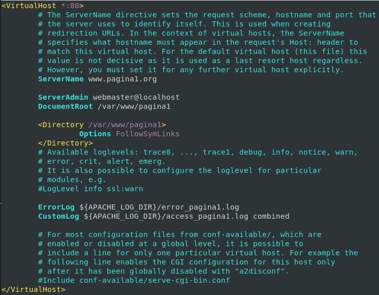

# Opciones de Directorio


|Directiva             |Uso                                                  |
|:--------------------:|-----------------------------------------------------|
|All                   |Todas las opciones excepto MultiViews.               |
|FollowSymLinks        |Se pueden seguir los enlaces simbólicos.  Si esta opción está activada, podemos a través de enlaces simbólicos, archivos que estén fuera del directorio Document Root.             |
|Indexes               |Cuando accedemos al directorio y no se encuentra un fichero por defecto (indicado en la directiva DirectoryIndex del módulo mod_dir), por ejemplo el index.html, se muestra la lista de ficheros (esto lo realiza el módulo mod_autoindex).                                                     |
|MultiViews            |Permite la negociación de contenido, mediante el módulo mod_negotiation. Por ejemplo: Ofrecer una página en un determinado idioma.                                                     |
|SymLinksIfOwnerMatc   |Se pueden seguir enlaces simbólicos, sólo cuando el fichero destino es del mismo propietario que el enlace simbólico.                                                     |
|ExecCGI               | Permite ejecutar script CGI (interfaz) usando el módulo mod_cgi.                                                    |

## Orden de indexado (POR DEFECTO)

```bash
cat /etc/apache2/mods-available/dir.conf
```



## Options de directorios  (apache2.conf)

```bash
cat /etc/apache2/apache2.conf
```


## Desactivar Indexes de sitio virtual

### Configuración del sitio virtual

*Añadir...*

```apache
<Directory /var/www/pagina1>
    Options -Indexes
</Directory>
```

```bash
vi /etc/apache2/sites-available/pagina1.conf
# Comprueba sintaxis
apachectl -t
systemctl restart apache2
```


## Seguimiento de Enlaces Simbólicos

### Preparación

```bash
#IMPORTANTE los permisos con los que creas el Archivo
echo "Estas accediendo a un enlace simbólico" > /home/usuario/paraLaWeb.txt
cd /var/www/pagina1/
ln -s /home/usuario/paraLaWeb.txt
ls -l --color
```

### Configuración del sitio virtual (Permitir)

*Añadir...*

```apache
<Directory /var/www/pagina1>
    Options FollowSymLinks
</Directory>
```

```bash
vi /etc/apache2/sites-available/pagina1.conf
```



### Comprobación
```bash
#Desde Cliente
firefox http://www.pagina1.org/paraLaWeb.txt
#Desde Servidor
apachectl -t
systemctl restart apache2
# ¿Un chown o chmod 777?
```
### Configuración del sitio virtual (Denegar)

*Añadir...*

```apache
<Directory /var/www/pagina1>
    Options -FollowSymLinks
</Directory>
```

```bash
vi /etc/apache2/sites-available/pagina1.conf
```

### Comprobación
```bash
#Desde Cliente
firefox http://www.pagina1.org/paraLaWeb.txt
#Desde Servidor
apachectl -t
systemctl restart apache2
```
_________________________________________________
*[Volver atrás...](/README.md)*

