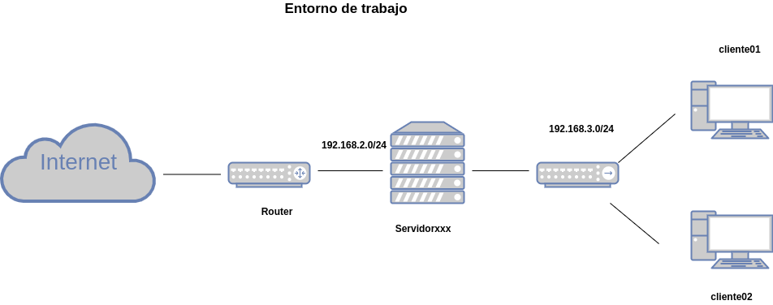
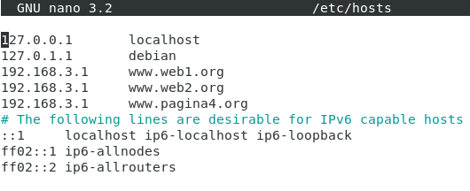
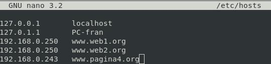
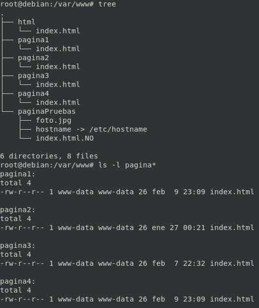
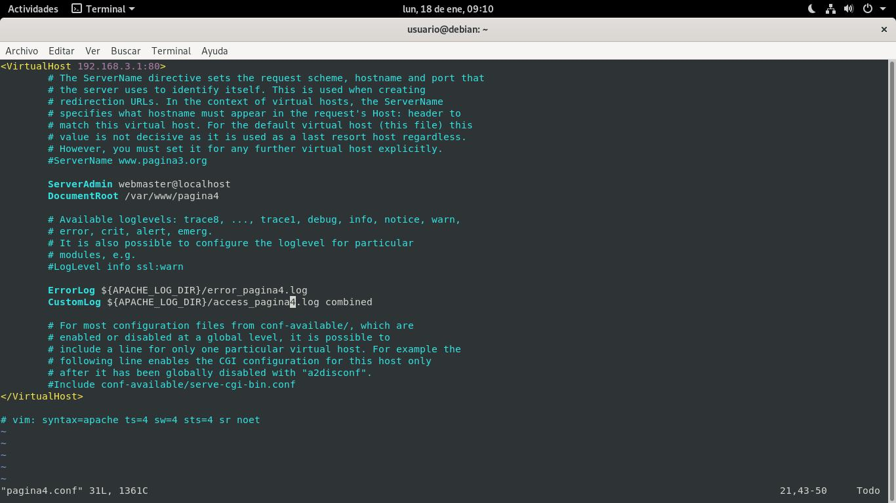
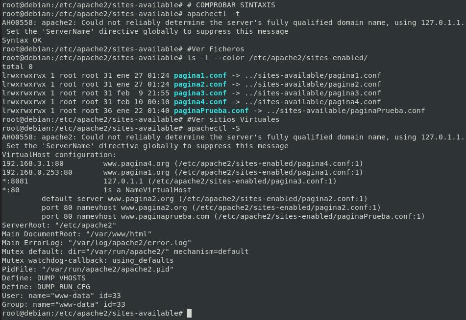

# Configuración de Sitio Virtual por IPs

## Objetivo



Nuestro servidor va a tener dos interfaces de red:

- enp0s3: 192.168.2.x → www.pagina1.org → /var/www/pagina1
- enp0s8: 192.168.3.1 → www.pagina4.org → /var/www/pagina4

*REQUISITOS*

*Registrar en servidor **DNS** el dominio, si no es posible, en el fichero ``/etc/hots``*

## Cliente01 "DNS"
```bash
vi /etc/hosts
```



## Cliente Máquina Fisíca "DNS"
```bash
vi /etc/hosts
```



## Preparación del entorno: las páginas web

```bash
cd /var/www/
mkdir pagina1
mkdir pagina4
echo "<h1>Soy la página 1</h1>" > pagina1/index.html
echo "<h1>Soy la página 4</h1>" > pagina4/index.html
```

**IMPORTANTE CAMBIAR el propietario de las carpetas y sus archivos**

```bash
chown -R www-data:www-data pagina1/
chown -R www-data:www-data pagina4/
```


## Creación de los sitios virtuales

### Página1.conf
```bash
cd /etc/apache2/sites-available
cp 000-default.conf pagina1.conf
vi pagina1.conf
```

[**CLIC PARA COPIAR FICHERO**](./pagina1.conf)

*NO SE COPIAN LAS TABULACIONES*
```apache
<VirtualHost 192.168.0.253:80>
	# The ServerName directive sets the request scheme, hostname and port that
	# the server uses to identify itself. This is used when creating
	# redirection URLs. In the context of virtual hosts, the ServerName
	# specifies what hostname must appear in the request's Host: header to
	# match this virtual host. For the default virtual host (this file) this
	# value is not decisive as it is used as a last resort host regardless.
	# However, you must set it for any further virtual host explicitly.
	ServerName www.pagina1.org

	ServerAdmin webmaster@localhost
	DocumentRoot /var/www/pagina1

	# Available loglevels: trace8, ..., trace1, debug, info, notice, warn,
	# error, crit, alert, emerg.
	# It is also possible to configure the loglevel for particular
	# modules, e.g.
	#LogLevel info ssl:warn

	ErrorLog ${APACHE_LOG_DIR}/error_pagina1.log
	CustomLog ${APACHE_LOG_DIR}/access_pagina1.log combined

	# For most configuration files from conf-available/, which are
	# enabled or disabled at a global level, it is possible to
	# include a line for only one particular virtual host. For example the
	# following line enables the CGI configuration for this host only
	# after it has been globally disabled with "a2disconf".
	#Include conf-available/serve-cgi-bin.conf
</VirtualHost>
```
### Página4.conf

```bash
cd /etc/apache2/sites-available
cp 000-default.conf pagina4.conf
vi pagina4.conf
```



[**CLIC PARA COPIAR FICHERO**](./pagina4.conf)

*NO SE COPIAN LAS TABULACIONES*
```apache
<VirtualHost 192.168.3.1:80>
	# The ServerName directive sets the request scheme, hostname and port that
	# the server uses to identify itself. This is used when creating
	# redirection URLs. In the context of virtual hosts, the ServerName
	# specifies what hostname must appear in the request's Host: header to
	# match this virtual host. For the default virtual host (this file) this
	# value is not decisive as it is used as a last resort host regardless.
	# However, you must set it for any further virtual host explicitly.
	#ServerName www.pagina3.org

	ServerAdmin webmaster@localhost
	DocumentRoot /var/www/pagina4

	# Available loglevels: trace8, ..., trace1, debug, info, notice, warn,
	# error, crit, alert, emerg.
	# It is also possible to configure the loglevel for particular
	# modules, e.g.
	#LogLevel info ssl:warn

	ErrorLog ${APACHE_LOG_DIR}/error_pagina4.log
	CustomLog ${APACHE_LOG_DIR}/access_pagina4.log combined

	# For most configuration files from conf-available/, which are
	# enabled or disabled at a global level, it is possible to
	# include a line for only one particular virtual host. For example the
	# following line enables the CGI configuration for this host only
	# after it has been globally disabled with "a2disconf".
	#Include conf-available/serve-cgi-bin.conf
</VirtualHost>

# vim: syntax=apache ts=4 sw=4 sts=4 sr noet
```

## Activamos los sitios virtuales creados

```bash
cd /etc/apache2/sites-available
a2ensite pagina1.conf
a2ensite pagina4.conf
systemctl restart apache2.service
systemctl status apache2.service
```

## Comprobaciones

### Servidor

```bash
# COMPROBAR SINTAXIS
apachectl -t
#Ver Ficheros
ls -l --color /etc/apache2/sites-enabled/
#Ver sitios Virtuales
apachectl -S
```



### Desde Red Interna

```bash
#Con Curl para sistemas sin entorno gráfico
curl pagina4.org
firefox pagina4.org
```

### Desde Red Externa

```bash
#Con Curl para sistemas sin entorno gráfico
curl pagina1.org
firefox pagina1.org
```

## Desactivar el sitio virtual por defecto.

En caso de desactivar el sitio virtual por defecto mostrará el primero que encuentre por orden alfabético 

```bash
a2dissite 000-default.conf 
systemctl reload apache2
```
_________________________________________________
*[Volver atrás...](/README.md)*

