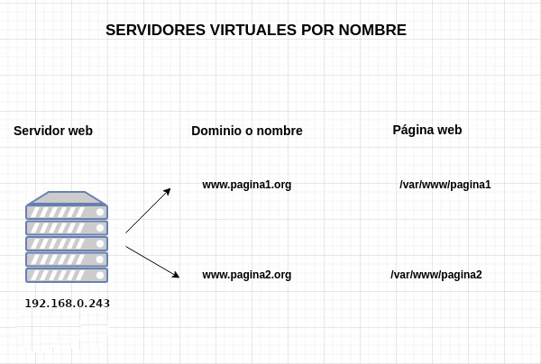
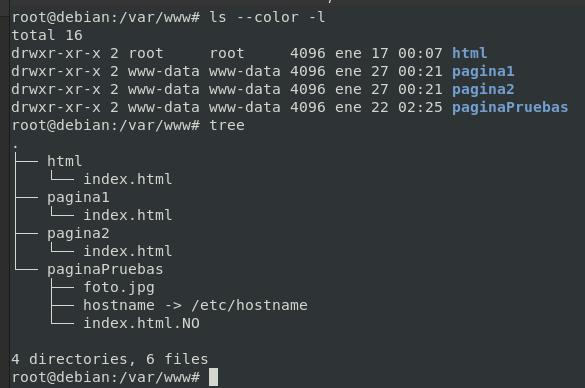
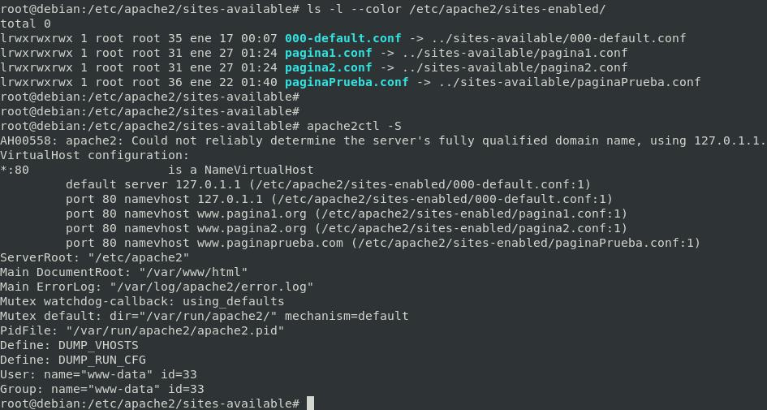
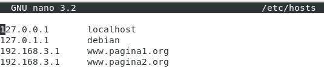
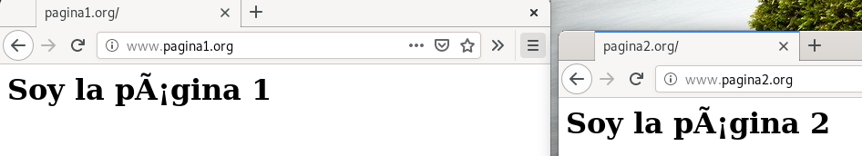

# Configuración de Sitio Virtual por nombre o dominio

## Objetivo



Tenemos dos sitios web:
www.pagina1.org → /var/www/pagina1
www.pagina2.org → /var/www/pagina2
Cada sitio web compartirá la misma dirección IP y el mismo puerto (80).

*REQUISITOS*

*Registrar en servidor **DNS** el dominio, si no es posible, en el fichero ``/etc/hots``*

## Preparación del entorno: las páginas web

```bash
cd /var/www/
mkdir pagina1
mkdir pagina2
echo "<h1>Soy la página 1</h1>" > pagina1/index.html
echo "<h1>Soy la página 2</h1>" > pagina2/index.html
```

**IMPORTANTE CAMBIAR el propietario de las carpetas y sus archivos**

```bash
chown -R www-data:www-data pagina1/
chown -R www-data:www-data pagina2/
```


## Creación de los sitios virtuales

### Pagina1.conf
```bash
cd /etc/apache2/sites-available
cp 000-default.conf pagina1.conf
vi pagina1.conf
```
[**CLIC PARA COPIAR FICHERO**](./pagina1.conf)

*NO SE COPIAN LAS TABULACIONES*
```apache
<VirtualHost *:80>
        # The ServerName directive sets the request scheme, hostname and port that
        # the server uses to identify itself. This is used when creating
        # redirection URLs. In the context of virtual hosts, the ServerName
        # specifies what hostname must appear in the request's Host: header to
        # match this virtual host. For the default virtual host (this file) this
        # value is not decisive as it is used as a last resort host regardless.
        # However, you must set it for any further virtual host explicitly.
        ServerName www.pagina1.org

        ServerAdmin webmaster@localhost
        DocumentRoot /var/www/pagina1

        # Available loglevels: trace8, ..., trace1, debug, info, notice, warn,
        # error, crit, alert, emerg.
        # It is also possible to configure the loglevel for particular
        # modules, e.g.
        #LogLevel info ssl:warn

        ErrorLog ${APACHE_LOG_DIR}/error_pagina1.log
        CustomLog ${APACHE_LOG_DIR}/access_pagina1.log combined

        # For most configuration files from conf-available/, which are
        # enabled or disabled at a global level, it is possible to
        # include a line for only one particular virtual host. For example the
        # following line enables the CGI configuration for this host only
        # after it has been globally disabled with "a2disconf".
        #Include conf-available/serve-cgi-bin.conf
</VirtualHost>
```
### Pagina2.conf

*Mismo proceso...*

[**CLIC PARA COPIAR FICHERO**](./pagina2.conf)

## Activamos los sitios virtuales creados

```bash
cd /etc/apache2/sites-available
a2ensite pagina1.conf
a2ensite pagina2.conf
systemctl restart apache2.service
systemctl status apache2.service
```


## Comprobaciones

### Sitios virtuales activos

```bash
ls -l --color /etc/apache2/sites-enabled/
apache2ctl -S
```



### Modificamos el /etc/host → En el cliente



Cuando **escribamos www.pagina1.org** lo mandará a 192.168.3.1 y el servidor web, analizará el dominio y **mostrará la página /var/www/pagina1**

Cuando **escribamos www.pagina2.org** lo mandará a 192.168.3.1 y el servidor web, analizará el dominio y **mostrará la página /var/www/pagina2**

**Pruebas de acceso:**



## Desactivar el sitio virtual por defecto.

En caso de desactivar el sitio virtual por defecto mostrará el primero que encuentre por orden alfabético 

```bash
a2dissite 000-default.conf 
systemctl reload apache2
```
_________________________________________________
*[Volver atrás...](/README.md)*

