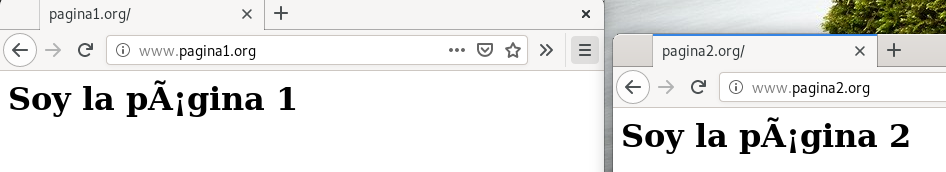

# Configuración de Sitio Virtual por puertos

## Objetivo


Tenemos dos sitios web:

- www.pagina1.org → /var/www/pagina1
- www.pagina3.org → /var/www/pagina3

Cuando accedemos por el puerto 80 nos muestra pagina1 y cuando accedemos por el puerto 8081 nos muestra la pagina3.

*REQUISITOS*

*Registrar en servidor **DNS** el dominio, si no es posible, en el fichero ``/etc/hots``*

## Preparación del entorno: las páginas web

```bash
cd /var/www/
mkdir pagina1
mkdir pagina3
echo "<h1>Soy la página 1</h1>" > pagina1/index.html
echo "<h1>Soy la página 3</h1>" > pagina3/index.html
```

**IMPORTANTE CAMBIAR el propietario de las carpetas y sus archivos**

```bash
chown -R www-data:www-data pagina1/
chown -R www-data:www-data pagina3/
```


## Creación de los sitios virtuales

### Pagina1.conf
```bash
cd /etc/apache2/sites-available
cp 000-default.conf pagina1.conf
cp 000-default.conf pagina3.conf
vi pagina1.conf
```


[**CLIC PARA COPIAR FICHERO**](./pagina1.conf)

**Quitando los comentarios y lineas en blanco así quedaría nuestro sitio virtual:**

*NO SE COPIAN LAS TABULACIONES*
```apache
<VirtualHost *:80>
        # ServerName www.example.com

        ServerAdmin webmaster@localhost
        DocumentRoot /var/www/pagina1
        ErrorLog ${APACHE_LOG_DIR}/error_pagina1.log
        CustomLog ${APACHE_LOG_DIR}/access_pagina1.log combined
</VirtualHost>

# vim: syntax=apache ts=4 sw=4 sts=4 sr noet

</VirtualHost>
```
### Pagina3.conf


[**CLIC PARA COPIAR FICHERO**](./pagina3.conf)

**Quitando los comentarios y lineas en blanco así quedaría nuestro sitio virtual:**

*NO SE COPIAN LAS TABULACIONES*
```apache
<VirtualHost *:8081>
        # ServerName www.example.com

        ServerAdmin webmaster@localhost
        DocumentRoot /var/www/pagina3
        ErrorLog ${APACHE_LOG_DIR}/error_pagina3.log
        CustomLog ${APACHE_LOG_DIR}/access_pagina3.log combined
</VirtualHost>

# vim: syntax=apache ts=4 sw=4 sts=4 sr noet

</VirtualHost>
```

## Activamos los sitios virtuales creados

```bash
cd /etc/apache2/sites-available
a2ensite pagina1.conf
a2ensite pagina3.conf
systemctl restart apache2.service
systemctl status apache2.service
```
<!-- 
## Comprobaciones

### Sitios virtuales activos

```bash
ls -l --color /etc/apache2/sites-enabled/
apache2ctl -S
```


### Modificamos el /etc/host → En el cliente


Cuando **escribamos www.pagina1.org** lo mandará a 192.168.3.1 y el servidor web, analizará el dominio y **mostrará la página /var/www/pagina1**

Cuando **escribamos www.pagina3.org** lo mandará a 192.168.3.1 y el servidor web, analizará el dominio y **mostrará la página /var/www/pagina3**

**Pruebas de acceso:**



## Desactivar el sitio virtual por defecto.

En caso de desactivar el sitio virtual por defecto mostrará el primero que encuentre por orden alfabético 

```bash
a2dissite 000-default.conf 
systemctl reload apache2
``` -->
_________________________________________________
*[Volver atrás...](/README.md)*

