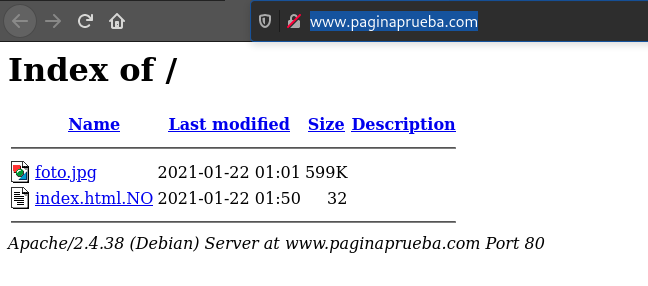
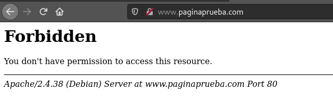

# Configuración de Sitios Virutales (Básica)

## Parámetros sitioVirtual.conf


Cualquier **IP** del Servidor puerto **80**:

``apache 
<VirtualHost *:80>``

**Dominio** del sitio virtual:

``apache 
ServerName www.pagina1.org``

**Correo** del administrador:

``apache 
ServerAdmin webmaster@localhost``

**Directorio** Raíz del Sitio Virtual:

``apache 
DocumentRoot /var/www/html``

**Directivas** **Características** y **rectriciones** del sitio Virtual Ejemplo:


| Directivas Options |
| -- |
| **All:** Todas las opciones excepto MultiViews. |
| **FollowSymLinks:** Se pueden seguir los enlaces simbólicos. *Si esta opción está activada, podemos a través de enlaces simbólicos, archivos que estén fuera del directorio Document Root.* |
| **Indexes:** Cuando accedemos al directorio y no se encuentra un fichero por defecto *(indicado en la directiva DirectoryIndex del módulo mod_dir), por ejemplo el index.html, se muestra la lista de ficheros (esto lo realiza el módulo mod_autoindex).* |
| **MultiViews:** Permite la negociación de contenido, mediante el módulo mod_negotiation. *Por ejemplo: Ofrecer una página en un determinado idioma.* |
| **SymLinksIfOwnerMatch:** Se pueden seguir enlaces simbólicos, sólo cuando el fichero destino es del mismo propietario que el enlace simbólico. |
| **ExecCGI:** Permite ejecutar script CGI (interfaz) usando el módulo mod_cgi. |

*Podemos activar o desactivar una opción en referencia con la configuración de un directorio padre mediante el signo + o -.*

## Configuración *Indexes*

### Fichero apache2.conf

*AL COPIAR NO SE COPIAN LAS TABULACIONES*
```apache
<Directory /var/www/>
    Options Indexes FollowSymLinks
    AllowOverride None
    Require all granted
</Directory>
```
*AL COPIAR NO SE COPIAN LAS TABULACIONES*

### Cofiguración en página 1 (Permitido)
*AL COPIAR NO SE COPIAN LAS TABULACIONES*
```apache
<Directory /var/www/paginaPruebas>
    Options -Indexes
</Directory>
```
*AL COPIAR NO SE COPIAN LAS TABULACIONES*


### Cofiguración en página 1 (Permitido)
*AL COPIAR NO SE COPIAN LAS TABULACIONES*
```apache
<Directory /var/www/paginaPruebas>
    Options Indexes
</Directory>
```
*AL COPIAR NO SE COPIAN LAS TABULACIONES*



_________________________________________________
*[Volver atrás...](../README.md)*

*[Volver a página de inicio...](../../../README.md)*