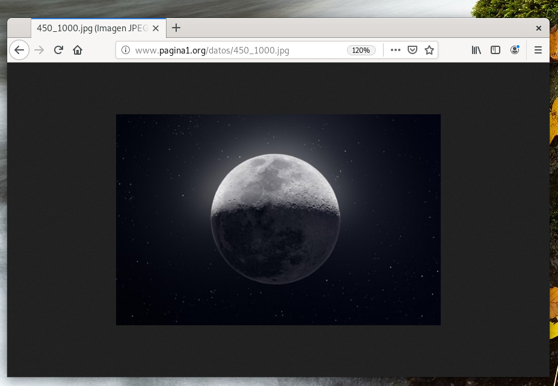

# Trabajando con alias

Las directiva Alias nos permite que el servidor sirva ficheros desde cualquier ubicación del sistema de archivo aunque este fuera del directorio indicado en el DocumentRoot.

Ej: `Alias "/imagenes" "/ftp/publico/imagenes"`

## Preparamos el los datos

```bash
mkdir /home/usuario/datos
cd /home/usuario/datos
wget https://i.blogs.es/5efe2c/cap_001/450_1000.jpg
chown -R usuario:usuario /home/usuario/datos
ls -l /home/usuario/datos
```

## Configuracion del Sitio Virtual

*Añadir...*

```bash
Alias "/datos" "/home/usuario/datos"
<Directory "/home/usuario/datos">
    Require all granted
</Directory>
```

```bash
vi /etc/apache2/sites-available/pagina1.conf
```

*NO SE COPIAN LAS TABULACIONES*

```apache
<VirtualHost *:80>
	# The ServerName directive sets the request scheme, hostname and port that
	# the server uses to identify itself. This is used when creating
	# redirection URLs. In the context of virtual hosts, the ServerName
	# specifies what hostname must appear in the request's Host: header to
	# match this virtual host. For the default virtual host (this file) this
	# value is not decisive as it is used as a last resort host regardless.
	# However, you must set it for any further virtual host explicitly.
	ServerName www.pagina1.org

	ServerAdmin webmaster@localhost
	DocumentRoot /var/www/pagina1
	
	
	Alias "/datos" "/home/usuario/datos"
	
	<Directory "/home/usuario/datos">
    		Require all granted
	</Directory>
	
	# Available loglevels: trace8, ..., trace1, debug, info, notice, warn,
	# error, crit, alert, emerg.
	# It is also possible to configure the loglevel for particular
	# modules, e.g.
	#LogLevel info ssl:warn

	ErrorLog ${APACHE_LOG_DIR}/error_pagina1.log
	CustomLog ${APACHE_LOG_DIR}/access_pagina1.log combined

	# For most configuration files from conf-available/, which are
	# enabled or disabled at a global level, it is possible to
	# include a line for only one particular virtual host. For example the
	# following line enables the CGI configuration for this host only
	# after it has been globally disabled with "a2disconf".
	#Include conf-available/serve-cgi-bin.conf
</VirtualHost>

# vim: syntax=apache ts=4 somprueba sintaxis
```
[**CLIC PARA COPIAR FICHERO**](./pagina1.conf)

### Comprobación
```bash
#Desde Cliente
firefox http://www.pagina1.org/datos
#Desde Servidor
apachectl -t
systemctl restart apache2
```

## Acceso vía web

***Acceder con la URL completa, no indexa el diretorio `/datos`***



_________________________________________________
*[Volver atrás...](/README.md)*