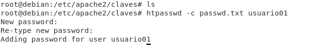
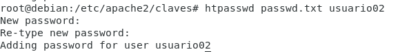
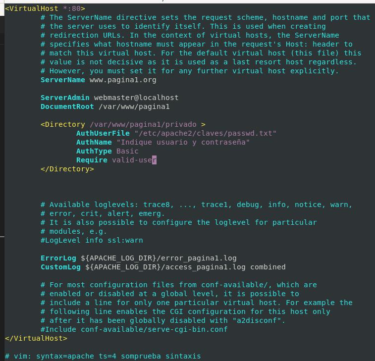
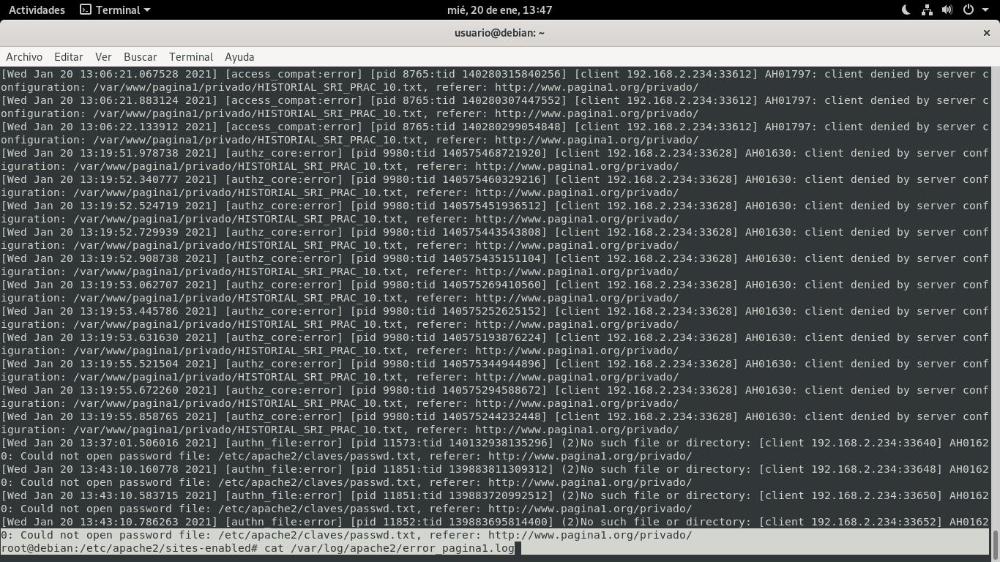
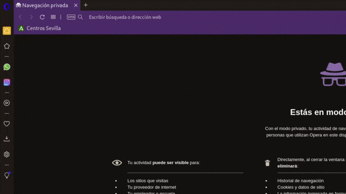
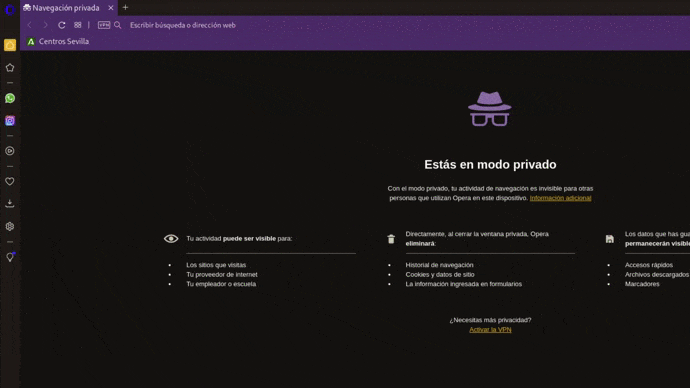

# Autenticación Básica

Apache permite configurar el servidor para que se exija un nombre de usuario y una contraseña para acceder a un recurso.
Existen varios módulos de autenticación en apache para ello, ya que los usuarios pueden estar guardados de distinta forma:
Base de datos
OpenLDAP
etc.

*Esta tarea se puede delegar en otros, por ejemplo en el php de tu web*

*Ejemplo de configuracion:*

```apache
<Directory "/var/www/pagina1/privado">
    AuthUserFile "/etc/apache2/claves/passwd.txt"
    AuthName "Palabra de paso"
    AuthType Basic
    Require valid-user
</Directory>
```

**Resumen Directivas**

| Directivas | Uso |
|:-:|-|
| **Directory** | En directory escribimos el directorio a proteger, que puede ser el raíz de nuestro Virtual Host o un subdirectorio. |
| **AuthUserFile** | En AuthUserFile ponemos el fichero que guardará la información de usuarios y contraseñas que debería de estar, como en este ejemplo, en un directorio que no sea visitable desde nuestro Apache |
| **AuthName** | Personalizar el mensaje que aparecerá en la ventana del navegador que nos pedirá la contraseña. |
| **Usuarios y Grupos** | AuthGroupFile, Require user, Require group |


## Activar Modulo de autenticación básica

```bash
#Módulos Activos
ls -l --color /etc/apache2/mods-enabled/
#Ver módulos: apachectl -M
#Módulo para la autenticación básica
ls -l --color /etc/apache2/mods-enabled/auth_basic.load
```

*Sí está desactivado...*

```bash
cd /etc/apache2/mods-available/
# Si esta desactivado:
a2enmod auth_basic
```

##  Crear Usuarios

```bash
mkdir /etc/apache2/claves/
htpasswd -c /etc/apache2/claves/passwd.txt usuario01 # Opción -c SOLO PARA CREAR EL FICHERO 1ª Vez
htpasswd /etc/apache2/claves/passwd.txt usuario02
```

*Si no está instalado...*

```bash
apt-get install apache2-utils
```




## Configurar Sitio Virtual

```bash
vi /etc/apache2/sites-available/pagina1.conf
```



**Quitando comentarios y líneas en blanco**

```apache
<VirtualHost *:80>
	ServerName www.pagina1.org
	ServerAdmin webmaster@localhost
	DocumentRoot /var/www/pagina1
	<Directory /var/www/pagina1/privado >
		AuthUserFile "/etc/apache2/claves/passwd.txt"
		AuthName "Indique usuario y contraseña"
		AuthType Basic
		Require valid-user
	</Directory>
	ErrorLog ${APACHE_LOG_DIR}/error_pagina1.log
	CustomLog ${APACHE_LOG_DIR}/access_pagina1.log combined
</VirtualHost>

# vim: syntax=apache ts=4 somprueba sintaxis
```

[**CLIC PARA COPIAR FICHERO**](./pagina1.conf)

**Sintaxis y Reiniciar Servicios...**

```bash
apache2ctl -t
systemctl restart apache2.service
systemctl status apache2.service
```

## Ver erroes Logs de Acceso

```bash
cat /var/log/apache2/error_pagina1.log
```




## Comprobar acceso



## Configurar sitio virtual para 1 solo usuario

Si solo nos interesa que acceda un usuario, utilizaremos: *Require user usuario01, en lugar de Require valid user*

```bash
vi /etc/apache2/sites-available/pagina1.conf
```

<!--  -->

**Quitando comentarios y líneas en blanco**

```apache
<VirtualHost *:80>
	ServerName www.pagina1.org
	ServerAdmin webmaster@localhost
	DocumentRoot /var/www/pagina1
	<Directory /var/www/pagina1/privado >
		AuthUserFile "/etc/apache2/claves/passwd.txt"
        Require user usuario01
		AuthName "Indique usuario y contraseña"
		AuthType Basic
		#Require valid-user
	</Directory>
	ErrorLog ${APACHE_LOG_DIR}/error_pagina1.log
	CustomLog ${APACHE_LOG_DIR}/access_pagina1.log combined
</VirtualHost>

# vim: syntax=apache ts=4 somprueba sintaxis
```
[**CLIC PARA COPIAR FICHERO**](./pagina1Solo1usuario.conf)

**Sintaxis y Reiniciar Servicios...**

```bash
apache2ctl -t
systemctl restart apache2.service
systemctl status apache2.service
```

*Acceso de 1 solo usuario (Solo puede entrar el usuario01)*



__________________________
*[Volver atrás...](/README.md)*