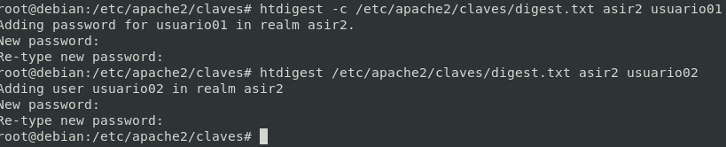

# Autenticación Complejo

## Políticas de acceso en Apache 2.4

En la versión 2.4 el control de acceso se determinan con la directiva `Require`, y las políticas de acceso la podemos indicar usando las directivas:

*Esta tarea se puede delegar en otros, por ejemplo en el php de tu web*

- **RequireAll**: Todas las condiciones dentro del bloque se deben cumplir para obtener el acceso.
- **RequireAny**: Al menos una de las condiciones en el bloque se debe cumplir.
- **RequireNone**: Ninguna de las condiciones se deben cumplir para permitir el acceso.

*Ejemplo de configuración:*

```apache
<Directory /dashboard>
    <RequireAny>
        Require ip 10.1
        Require group admins
    </RequireAny>
</Directory>
```

**Resumen Directivas**

| Directivas | Uso |
|:-:|-|
| **Directory** | En directory escribimos el directorio a proteger, que puede ser el raíz de nuestro Virtual Host o un subdirectorio. |
| **AuthUserFile** | En AuthUserFile ponemos el fichero que guardará la información de usuarios y contraseñas que debería de estar, como en este ejemplo, en un directorio que no sea visitable desde nuestro Apache |
| **AuthName** | Personalizar el mensaje que aparecerá en la ventana del navegador que nos pedirá la contraseña. |
| **Usuarios y Grupos** | AuthGroupFile, Require user, Require group |


## Activar Modulo de autenticación

```bash
#Módulos Activos
ls -l --color /etc/apache2/mods-enabled/
#Ver módulos: apachectl -M
#Módulo para la autenticación básica
ls -l --color /etc/apache2/mods-enabled/auth_digest.load
```

*Sí está desactivado...*

```bash
a2enmod auth_digest
systemctl restart apache2 
```

##  Crear Usuarios

**En digest es necesario indicar el grupo o dominio además del usuario**
**El valor de la directiva `AuthName` será el grupo o dominio indicado**

```bash
mkdir /etc/apache2/claves/
htdigest -c /etc/apache2/claves/digest.txt asir2 usuario01 # Opción -c SOLO PARA CREAR EL FICHERO 1ª Vez
htdigest /etc/apache2/claves/digest.txt asir2 usuario02
```

*Si no está instalado...*

```bash
apt-get install apache2-utils
```




## Configuraraciones Sitio Virtual

**Configurar el acceso al directorio privado para la red interna y para un usuario válido de digest.txt**

```bash
vi /etc/apache2/sites-available/pagina1.conf
```

**Quitando comentarios y líneas en blanco**

```apache
<VirtualHost *:80>
	ServerName www.pagina1.org
	ServerAdmin webmaster@localhost
	DocumentRoot /var/www/pagina1
	<Directory /var/www/pagina1/privado >
		AuthUserFile "/etc/apache2/claves/digest.txt"
		AuthName "asir2"
		AuthType Digest
		<RequireAll>
			Require ip 192.168.3
			Require valid-user
		</RequireAll>
	</Directory>
	ErrorLog ${APACHE_LOG_DIR}/error_pagina1.log
	CustomLog ${APACHE_LOG_DIR}/access_pagina1.log combined
</VirtualHost>

# vim: syntax=apache ts=4 somprueba sintaxis
```

[**CLIC PARA COPIAR FICHERO**](./pagina1.conf)

**Sintaxis y Reiniciar Servicios...**

```bash
apache2ctl -t
systemctl restart apache2.service
systemctl status apache2.service
```
### Comprobar acceso

- El cliente de la red externa debe recibir un error 403.
- El cliente de la red interna debe poder acceder pero siempre con un usuario autenticado.

**Modificación para cumplir UNA única condición (entre por la red interna o que se valide con usuario y contraseña)**

```bash
vi /etc/apache2/sites-available/pagina1.conf
```

**Quitando comentarios y líneas en blanco**

```apache
<VirtualHost *:80>
	ServerName www.pagina1.org
	ServerAdmin webmaster@localhost
	DocumentRoot /var/www/pagina1
	<Directory /var/www/pagina1/privado >
		AuthUserFile "/etc/apache2/claves/digest.txt"
		AuthName "asir2"
		AuthType Digest
		<RequireAny>
			Require ip 192.168.3
			Require valid-user
		</RequireAny>
	</Directory>
	ErrorLog ${APACHE_LOG_DIR}/error_pagina1.log
	CustomLog ${APACHE_LOG_DIR}/access_pagina1.log combined
</VirtualHost>

# vim: syntax=apache ts=4 somprueba sintaxis
```

[**CLIC PARA COPIAR FICHERO**](./pagina1UnaUOtra.conf)

**Sintaxis y Reiniciar Servicios...**

```bash
apache2ctl -t
systemctl restart apache2.service
systemctl status apache2.service
```


### Comprobar acceso

- El cliente de la red externa debe poder acceder pero siempre con un usuario autenticado.
- El cliente de la red interna debe poder acceder sin atenticación.


## Ver errores Logs de Acceso

```bash
cat /var/log/apache2/error_pagina1.log
```


## Configurar sitio virtual para cumplir UNA única condición para y ADEMÁS solo acceda 1 solo USUARIO

Si solo nos interesa que acceda un usuario, utilizaremos: *Require user usuario01, en lugar de Require valid user*

```bash
vi /etc/apache2/sites-available/pagina1.conf
```

<!--  -->

**Quitando comentarios y líneas en blanco**

```apache
<VirtualHost *:80>
	ServerName www.pagina1.org
	ServerAdmin webmaster@localhost
	DocumentRoot /var/www/pagina1
	<Directory /var/www/pagina1/privado >
		AuthUserFile "/etc/apache2/claves/digest.txt"
		Require user usuario01
		AuthName "asir2"
		AuthType Digest
		<RequireAny>
			Require ip 192.168.3
			Require user usuario01
		</RequireAny>
	</Directory>
	ErrorLog ${APACHE_LOG_DIR}/error_pagina1.log
	CustomLog ${APACHE_LOG_DIR}/access_pagina1.log combined
</VirtualHost>

# vim: syntax=apache ts=4 somprueba sintaxis
```
[**CLIC PARA COPIAR FICHERO**](./pagina1UnaUOtra.conf)

**Sintaxis y Reiniciar Servicios...**

```bash
apache2ctl -t
systemctl restart apache2.service
systemctl status apache2.service
```

### Comprobar acceso

- El cliente debe poder acceder pero siempre autenticando CON un `usuario01` .
- El cliente debe poder acceder y ademas autenticarse con un usuario.

__________________________
*[Volver atrás...](/README.md)*