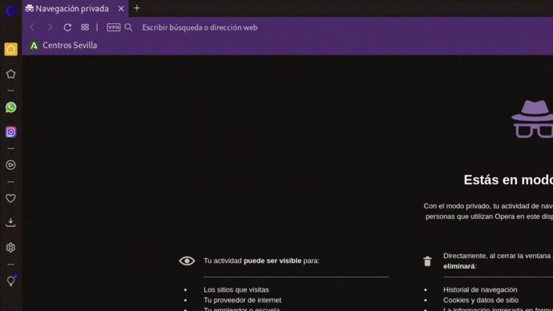
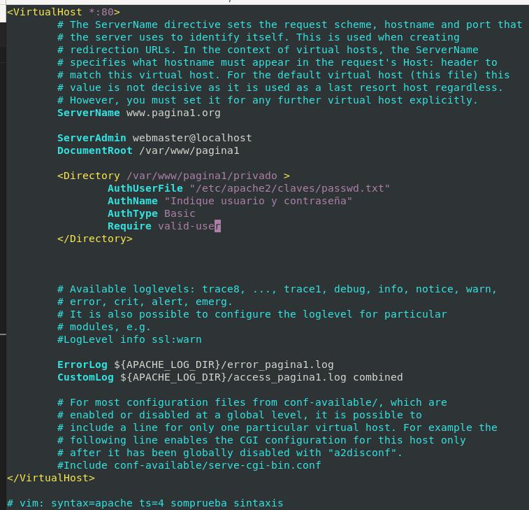
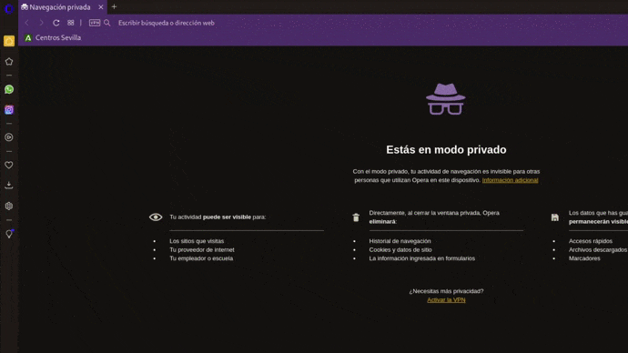

# Autenticación Digest

La autentificación básica, tiene un problema y es que aunque las contraseñas están encriptadas en el fichero, cuando se realiza la petición o el acceso la contraseña viaja en texto plano.
La autentificación tipo digest soluciona el problema de la transferencia de contraseñas en claro sin necesidad de usar SSL. 
Se aplica una función hash a la contraseña antes de ser enviada sobre la red, lo que resulta más seguro que enviarla en texto plano como en la autenticación básica. 
Cada vez que se conecta la cadena encriptada es diferente.
El procedimiento, como veréis, es muy similar al tipo básico pero cambiando algunas de las directivas y usando la utilidad htdigest en lugar de htpassword para crear el fichero de contraseñas. 
El módulo de autenticación necesario suele venir con Apache pero no habilitado por defecto. 

Teoría obtenida: [mftienda](https://github.com/mftienda/).

a2enmod auth_digest
systemctl restart apache2 

*Esta tarea se puede delegar en otros, por ejemplo en el php de tu web*

*Ejemplo de configuracion:*

```apache
<Directory "/var/www/pagina1/privado">
    AuthUserFile "/etc/apache2/claves/digest.txt"
    AuthName "Palabra de paso"
    AuthType Basic
    Require valid-user
</Directory>
```

**Resumen Directivas**

| Directivas | Uso |
|:-:|-|
| **Directory** | En directory escribimos el directorio a proteger, que puede ser el raíz de nuestro Virtual Host o un subdirectorio. |
| **AuthUserFile** | En AuthUserFile ponemos el fichero que guardará la información de usuarios y contraseñas que debería de estar, como en este ejemplo, en un directorio que no sea visitable desde nuestro Apache |
| **AuthName** | Personalizar el mensaje que aparecerá en la ventana del navegador que nos pedirá la contraseña. |
| **Usuarios y Grupos** | AuthGroupFile, Require user, Require group |


## Activar Modulo de autenticación básica

```bash
#Módulos Activos
ls -l --color /etc/apache2/mods-enabled/
#Ver módulos: apachectl -M
#Módulo para la autenticación básica
ls -l --color /etc/apache2/mods-enabled/auth_digest.load
```

*Sí está desactivado...*

```bash
a2enmod auth_digest
systemctl restart apache2 
```

##  Crear Usuarios

**En digest es necesario indicar el grupo o dominio además del usuario**
**El valor de la directiva `AuthName` será el grupo o dominio indicado**

```bash
mkdir /etc/apache2/claves/
htdigest -c /etc/apache2/claves/digest.txt asir2 usuario01 # Opción -c SOLO PARA CREAR EL FICHERO 1ª Vez
htdigest /etc/apache2/claves/digest.txt asir2 usuario02
```

*Si no está instalado...*

```bash
apt-get install apache2-utils
```


## Configurar Sitio Virtual

```bash
vi /etc/apache2/sites-available/pagina1.conf
```


**Quitando comentarios y líneas en blanco**

```apache
<VirtualHost *:80>
	ServerName www.pagina1.org
	ServerAdmin webmaster@localhost
	DocumentRoot /var/www/pagina1

	<Directory /var/www/pagina1/privado >
		AuthUserFile "/etc/apache2/claves/digest.txt"
		AuthName "asir2"
		AuthType Digest
		Require valid-user
	</Directory>
	ErrorLog ${APACHE_LOG_DIR}/error_pagina1.log
	CustomLog ${APACHE_LOG_DIR}/access_pagina1.log combined
</VirtualHost>

# vim: syntax=apache ts=4 somprueba sintaxis
```

[**CLIC PARA COPIAR FICHERO**](./pagina1.conf)

**Sintaxis y Reiniciar Servicios...**

```bash
apache2ctl -t
systemctl restart apache2.service
systemctl status apache2.service
```

## Ver erroes Logs de Acceso

```bash
cat /var/log/apache2/error_pagina1.log
```


## Comprobar acceso



## Configurar sitio virtual para 1 solo usuario

Si solo nos interesa que acceda un usuario, utilizaremos: *Require user usuario01, en lugar de Require valid user*

```bash
vi /etc/apache2/sites-available/pagina1.conf
```

<!--  -->

**Quitando comentarios y líneas en blanco**

```apache
<VirtualHost *:80>
	ServerName www.pagina1.org
	ServerAdmin webmaster@localhost
	DocumentRoot /var/www/pagina1
	<Directory /var/www/pagina1/privado >
		AuthUserFile "/etc/apache2/claves/digest.txt"
		Require user usuario01
		AuthName "asir2"
		AuthType Digest
		#Require valid-user
	</Directory>
	ErrorLog ${APACHE_LOG_DIR}/error_pagina1.log
	CustomLog ${APACHE_LOG_DIR}/access_pagina1.log combined
</VirtualHost>

# vim: syntax=apache ts=4 somprueba sintaxis
```
[**CLIC PARA COPIAR FICHERO**](./pagina1Solo1usuario.conf)

**Sintaxis y Reiniciar Servicios...**

```bash
apache2ctl -t
systemctl restart apache2.service
systemctl status apache2.service
```

*Acceso de 1 solo usuario (Solo puede entrar el usuario01)*



__________________________
*[Volver atrás...](/README.md)*