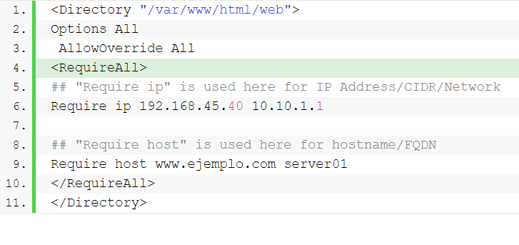
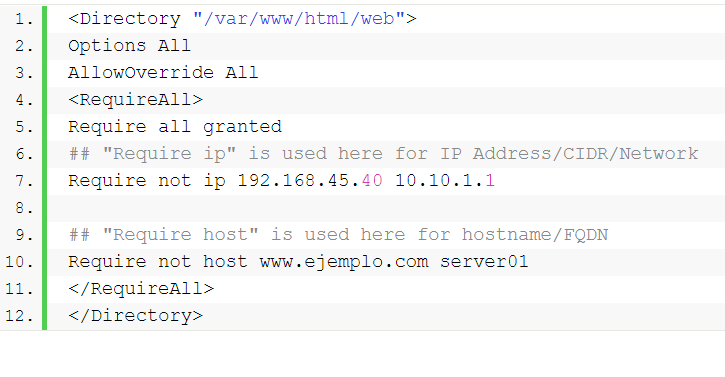
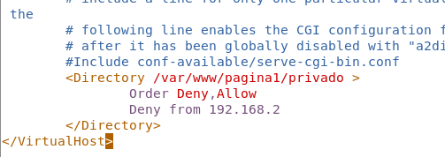
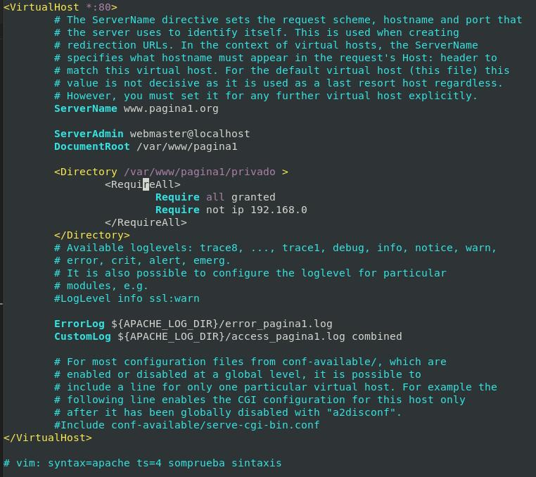
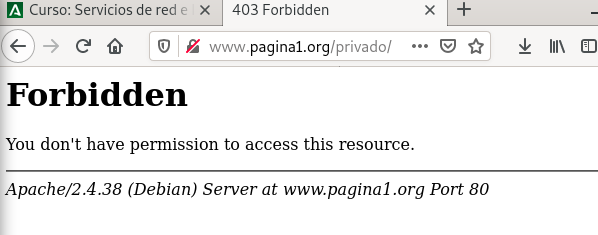

# Control de acceso

## Directiva Apache 2.2

[Clic para ver Directivas Apache 2.2](directivasApacher2-2.md)

## Directiva Apache 2.4

- Require all granted: El acceso es permitido incondicionalmente.

-Require all denied: El acceso es denegado incondicionalmente.

- Require user userid [userid] ...: El acceso es permitido sólo si los usuarios indicados se han autentificado.

- Require group group-name [group-name] ...: El acceso es permitido sólo a los grupos de usuarios especificados.

- Require valid-user: El acceso es permitido a los usuarios válidos.
A todos los usuarios que tengamos definidos.

- Require ip 10 172.20 192.168.2: El acceso es permitido si se hace desde el conjunto de direcciones especificadas.
Las que empiecen por 10, 172.20, 192.168.2 No es necesario poner la IP completa.
- Require host dominio: El acceso es permitido si se hace desde el 
dominio especificado.

- Require local: El acceso es permitido desde localhost.
Se puede usar el operador not para indicar la denegación, por ejemplo:
Require not ip 10.0

## Ejemplos

### Ejemplo 1

RequireAll --> Todas las condiciones que pongamos se deben cumplir



### Ejemplo 2

RequireAll --> Todas las condiciones que pongamos se deben cumplir



## Preparamos directorios y ficheros
```bash
mkdir /var/www/pagina1/privado
cd /var/www/pagina1/privado
wget https://i.blogs.es/8e8f64/lo-de-que-comprar-una-casa-es-la-mejor-inversion-hay-generaciones-que-ya-no-lo-ven-ni-de-lejos---1/450_1000.jpg
chown -R usuario:usuario /var/www/pagina1/privado
tree /var/www/pagina1/
ls -l /var/www/pagina1/
```

## Prohibición al directorio privado las IP del tipo: 192.168.0 *APACHE 2.2*

```bash
vi /etc/apache2/sites-available/pagina1.conf
```



**Sintaxis y Reiniciar Servicios...**

```bash
apache2ctl -t
systemctl restart apache2.service
systemctl status apache2.service
```


## Prohibición al directorio privado las IP del tipo: 192.168.0 *APACHE 2.4*

```bash
vi /etc/apache2/sites-available/pagina1.conf
```



**Quitando comentarios y líneas en blanco**

```apache
<VirtualHost *:80>
	ServerName www.pagina1.org
	ServerAdmin webmaster@localhost
	DocumentRoot /var/www/pagina1
	<Directory /var/www/pagina1/privado >
		<RequireAll>
			Require all granted
			Require not ip 192.168.0
		</RequireAll>
	</Directory>
	ErrorLog ${APACHE_LOG_DIR}/error_pagina1.log
	CustomLog ${APACHE_LOG_DIR}/access_pagina1.log combined
</VirtualHost>

# vim: syntax=apache ts=4 somprueba sintaxis
```

**Sintaxis y Reiniciar Servicios...**

```bash
apache2ctl -t
systemctl restart apache2.service
systemctl status apache2.service
```



__________________________
*[Volver atrás...](/README.md)*

