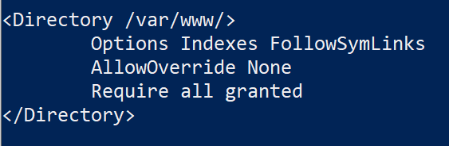
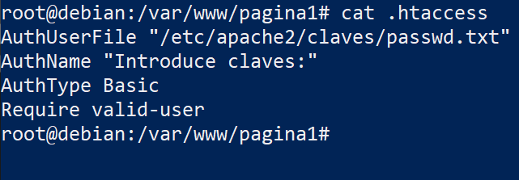
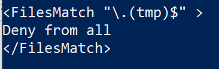

# Fichero htacces

Un fichero .htaccess (hypertext access), también conocido como archivo de configuración distribuida, es un fichero especial, popularizado por el Servidor HTTP Apache que nos permite definir diferentes directivas de configuración para cada directorio (con sus respectivos subdirectorios) sin necesidad de editar el archivo de configuración principal de Apache.

¿Dónde se crea el fichero .htaccess?

En el directorio que nos interese aplicar la configuración.

Por defecto, los ficheros .htaccess están deshabilitados.

Para permitir el uso de los ficheros .htaccess o restringir las directivas que se pueden aplicar usamos la directiva AllowOverride (Permitir la sobre escritura), que puede ir acompañada de una o varias opciones:


|Directiva  |Uso  |
|:---------:|---------|
|**All**|Se pueden usar todas las directivas permitidas.|
|**None**|Se ignora el fichero .htaccess. Valor por defecto.|
|AuthConfig|AuthName, AuthType, AuthUserFile, Require, …|
|FileInfo|Directivas relacionadas con el mapeo de URL: redirecciones, módulo rewrite, …|
|Indexes|Directiva que controlan la visualización de listado de ficheros.|
|Limit|Directivas para controlar el control de acceso: Allow, Deny y Order.|

## Cambiar la directiva AllowOverride.

*Añadir:*

`AllowOverride`

### Activar en apache2.conf

```bash
vi /etc/apache2/apache2.conf
```


ó

### Directamente en el sitio virtual

```bash
vi /etc/apache2/pagina1.conf
```

*Reiniciamos el servicio*

```bash
apache2ctl -t
systemctl restart apache2 
systemctl status apache2 
```

## Configuraciones desde .htaccess

### Crear htaccess

```bash
cd /var/www/pagina1/
touch /var/www/pagina1/.htaccess
chown -R usuario:usuario /var/www/pagina1/
ls -lRa --color /var/www/pagina1/
```

### Indexes

#### Permitir Indexes

*renombramos el index.html para que no lo lea por defecto*

```bash
echo "Options Indexes" > /var/www/pagina1/.htaccess
firefox http://www.pagina1.org/
```
*No es necesario recargar el servicio los cambios son desde el cliente*

#### Denegar Indexes

```bash
echo "Options -Indexes" > /var/www/pagina1/.htaccess
firefox http://www.pagina1.org/
```

*No es necesario recargar el servicio los cambios son desde el cliente*

***Comprobaciones:** *debe devolver un error 403 ó Forbidden*

### Cliente modifica el sitio virtual: *Activa la autenticación*


```bash
echo 'AuthUserFile "/etc/apache2/claves/passwd.txt"' > /var/www/pagina1/.htaccess
echo 'AuthName "Indroduce las claves:"' >> /var/www/pagina1/.htaccess
echo 'AuthType Basic' >> /var/www/pagina1/.htaccess
echo 'Require valid-user' >> /var/www/pagina1/.htaccess
firefox http://www.pagina1.org/
```
*No es necesario recargar el servicio los cambios son desde el cliente*



*ES NECESARIO CREAR LOS USUARIOS EN CASO DE QUE NO EXISTA*

```bash
mkdir /etc/apache2/claves/
htpasswd -c /etc/apache2/claves/passwd.txt usuario01 # Opción -c SOLO PARA CREAR EL FICHERO 1ª Vez
htpasswd /etc/apache2/claves/passwd.txt usuario02
```

*Si no está instalado htpasswd...*

```bash
apt-get install apache2-utils
```

### Cliente modifica el sitio virtual: Deniega los archivos .tmp


__________________________
*[Volver atrás...](/README.md)*