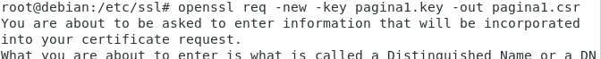

# Acceso Seguro SSL/TLS (HTTPs)

Autoridades de certificación gratuitas:
**Let’s Encrypt**: Tiene un cliente  llamado Certbot que automatiza todo el ciclo de vida de la gestión de certificados: obtención, renovación, revocación, instalación en el servidor web, etc.

**CAcert**: es Free digital certificates for everyone y es que la utilización de certificados emitidos por CA comerciales no es posible para todos los sitios de Internet debido a su coste, lo que limita su uso a transacciones económicas o sitios con datos relevantes. CAcert es una organización sin ánimo de lucro que mantiene una infraestructura equivalente a una CA comercial aunque con ciertas limitaciones.

## Objetivo:

Necesitamos:
1. Generar un certificado TLS/SSL, formato 509, que indique que el servidor web es un servidor legítimo.
Ese certificado llevará :
- Entidad de nuestro sitio web.
- Clave pública de nuestro sitio web.
- Firma de una autoridad de certificación.

2. Una clave privada, para establecer una comunicación cliente-servidor encriptada.
3. Instalarlo en el servidor web.

Para generar un certificado TLS/SSL vamos a utilizar la herramienta OpenSSL.

## Activar modulo SSL

```bash
#Módulo para la autenticación básica
ls -l --color /etc/apache2/mods-enabled/ssl.load
```

*Sí está desactivado...*

```bash
a2enmod ssl
systemctl restart apache2 
```

## Generar pareja de claves (OpenSSL)

### Instalar OpenSSL

```bash
apt policy openssl
#Si no esta instalado..
apt install openssl
```

*Certificados y claves actuales*
```bash
ls /etc/ssl
```

**Generar certificado firmado y claves en 1 paso**

```bash
openssl req -x509 -nodes -days 1095 -newkey rsa:2048 -keyout /etc/ssl/pagina1.key -out /etc/ssl/pagina1.crt
```
ó

**Para hacerlo en 3 paso**

```bash
cd /etc/ssl
```

*Generar clave*


```bash
ls /etc/ssl
```

*Generar Certificado*


*Firmar Certificado*


## Configuración del sitio virtual

cp /etc/apache2/sites-available/pagina1.conf /etc/apache2/sites-available/pagina1-ssl.conf

*Para activar Https esta es la configuración principal...*

```apache
SSLEngine on
SSLCertificateKeyFile /etc/ssl/pagina1.key
SSLCertificateFile /etc/ssl/pagina1.crt
```


*Configuración*
# DA ERROR
```apache
<VirtualHost *:443>
	ServerName www.pagina1.org
	ServerAdmin webmaster@localhost
	DocumentRoot /var/www/pagina1
	SSLEngine on
	SSLCertificateFile	/etc/ssl/pagina1.crt
	SSLCertificateKeyFile	/etc/ssl/pagina1.key
	ErrorLog ${APACHE_LOG_DIR}/error_pagina1-ssl.log
	CustomLog ${APACHE_LOG_DIR}/access_pagina1-ssl.log combined
	# PARA REDIRECIONAMIENTO --> SI NO PIDE REDIRECCIONAMIENTO COMENTAR
	RewriteEngine on
	RewriteCond %{SERVER_NAME} =www.pagina1.org
	RewriteRule ^https://%{SERVER_NAME}%{REQUEST_URI} [L,NE,R=permanent]
</VirtualHost>

# vim: syntax=apache ts=4 somprueba sintaxis
```

### Activar sitio virtual

```bash
a2ensite pagina1-ssl.conf
```

*Reiniciamos el servicio*

```bash
apache2ctl -t
systemctl restart apache2 
systemctl status apache2 
```

__________________________
*[Volver atrás...](/README.md)*