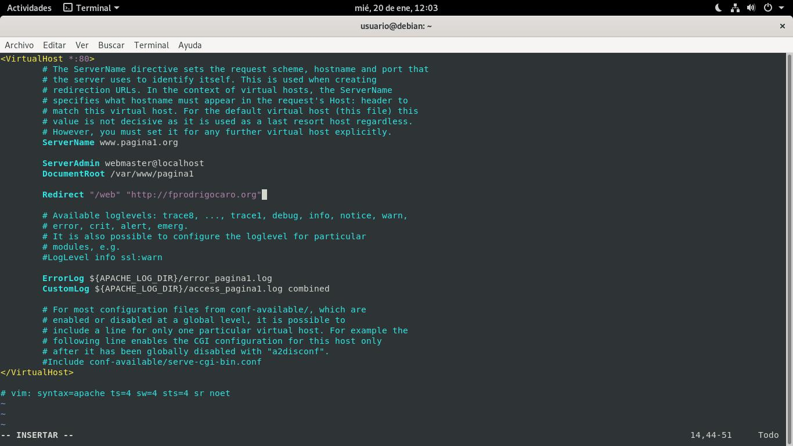
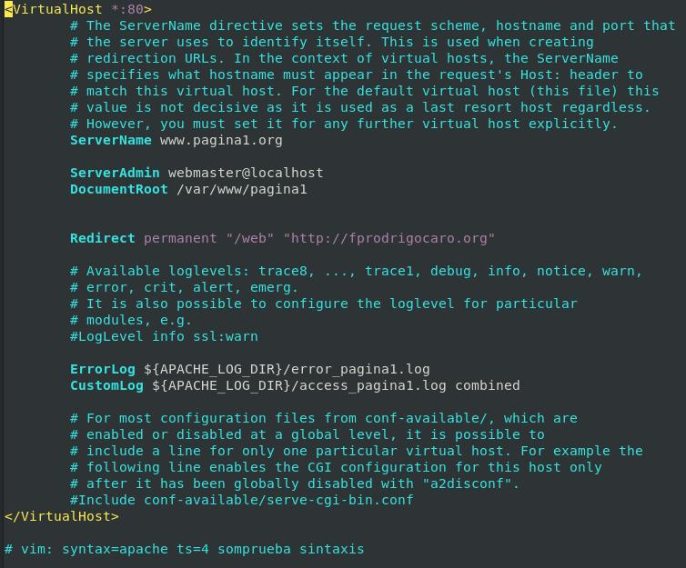
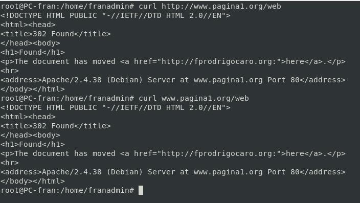
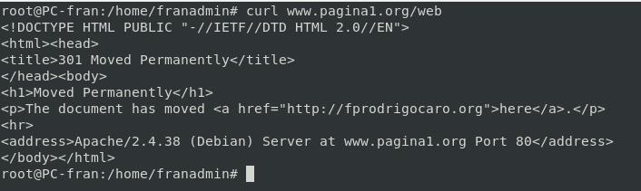
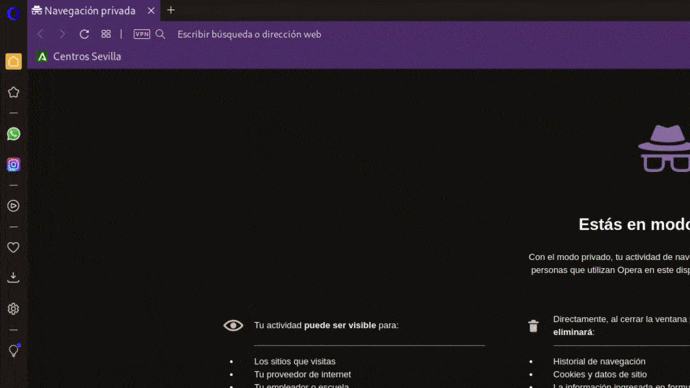

# Mapeado de URL: Redireccionamiento

Gracias a la directiva **redirect**, podemos decirle al cliente donde se encuentra la nueva ubicación.

Podemos crear redirecciones de dos tipos:
- Permanentes: se da cuando el recurso sobre el que se hace la petición ha sido ‘movido permanentemente‘ hacia una dirección distinta, es decir, hacia otra URL. 
Devuelven el estado: 301 (Los buscadores indexan las redirecciones permanentes.)
- Temporales: se da cuando el recurso sobre el que se hace la petición ha sido “encontrado” pero reside temporalmente en una dirección distinta, es decir, en otra URL. 
Devuelven el estado:  302

## Configuración de redireccionamientos

*REQUISITOS*

*Registrar en servidor **DNS** el dominio, si no es posible, en el fichero ``/etc/hots``*

### Redireccionamientos temporales

```vi /etc/apache2/sites-available/pagina1.conf



**Quitando comentarios y lineas en blanco**
```apache
<VirtualHost *:80>
	ServerName www.pagina1.org
	ServerAdmin webmaster@localhost
	DocumentRoot /var/www/pagina1
	Redirect "/web" "http://fprodrigocaro.org"
	ErrorLog ${APACHE_LOG_DIR}/error_pagina1.log
	CustomLog ${APACHE_LOG_DIR}/access_pagina1.log combined
</VirtualHost>

# vim: syntax=apache ts=4 somprueba sintaxis
```
**Reiniciar Servicios...**

```bash
systemctl restart apache2.service
systemctl status apache2.service
```

[**CLIC PARA COPIAR FICHERO**](./pagina1Temporal.conf)

### Redireccionamientos Permanentes

```vi /etc/apache2/sites-available/pagina1.conf



**Quitando comentarios y lineas en blanco**
```apache
<VirtualHost *:80>
	ServerName www.pagina1.org
	ServerAdmin webmaster@localhost
	DocumentRoot /var/www/pagina1
	Redirect permanent "/web" "http://fprodrigocaro.org"
	ErrorLog ${APACHE_LOG_DIR}/error_pagina1.log
	CustomLog ${APACHE_LOG_DIR}/access_pagina1.log combined
</VirtualHost>

# vim: syntax=apache ts=4 somprueba sintaxis
```

[**CLIC PARA COPIAR FICHERO**](./pagina1Permanente.conf)

**Reiniciar Servicios...**

```bash
apache2ctl -t
systemctl restart apache2.service
systemctl status apache2.service
```

## Comprobaciones

```bash
firefix www.pagina1.org/web
# SIN ENTORNO
curl www.pagina1.org/web
```

*Aparece como codigo de redireccion 302 (Temporal)*


*Aparece como codigo de redireccion 30 (Permanente)*




### Sitios virtuales activos

```bash

```
<!-- 
### Modificamos el /etc/host → En el cliente


**Pruebas de acceso:** -->

__________________________
*[Volver atrás...](/README.md)*

